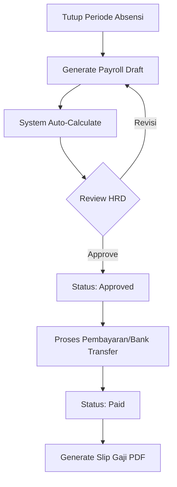

# Alur dan Dokumentasi Sistem Payroll SIP PDAM Purbalingga

Dokumen ini menjelaskan alur kerja, komponen perhitungan, dan logika sistem penggajian (payroll) pada aplikasi SIP PDAM Purbalingga.

## 1. Kategori Kepegawaian & Gaji Dasar

Sistem menghitung gaji dasar berdasarkan status kepegawaian:

| Status | Logika Perhitungan Gaji Dasar |
| :--- | :--- |
| **PNS / Tetap** | Sesuai dengan Gaji Pokok pada Golongan/Pangkat yang berlaku. |
| **Kontrak** | Sesuai dengan nominal yang tertera pada kontrak atau standar UMK. |
| **CAPEG / Probation** | Umumnya 80% dari Gaji Pokok Golongan (dapat disesuaikan via formula). |
| **THL (Tenaga Harian Lepas)** | Dihitung berdasarkan jumlah hari hadir: `(Gaji Standar / 30) * Hari Kehadiran`. |

## 2. Komponen Pendapatan (Incomes)

Berdasarkan struktur slip gaji PDAM, komponen pendapatan terdiri dari:

### A. Gaji Pokok & Tunjangan Melekat
- **Gaji Pokok**: Sesuai Golongan/Pangkat.
- **Tunjangan Keluarga**: Umumnya 10% dari Gaji Pokok (Istri/Suami) + 2% per anak (maks 2).
- **Pembulatan**: Digunakan untuk menggenapkan total pendapatan.
- **Tunjangan Beras**: Nilai tetap (misal: Rp 150.000).

### B. Tunjangan Jabatan & Kesejahteraan
- **Tunjangan Jabatan**: Berdasarkan eselon atau level manajemen.
- **TKK (Tunjangan Kesejahteraan Karyawan)**: Tunjangan tambahan yang bersifat tetap per level.
- **Tunjangan Kesehatan**: Subsidi untuk iuran kesehatan atau fasilitas medis.

### C. Tunjangan Khusus PDAM
- **Tunjangan Air**: Subsidi penggunaan air khusus untuk pegawai PDAM.

### D. Tunjangan Lainnya
- **Lembur**: Mengacu pada referensi SHS.
- **Insentif**: Berdasarkan pencapaian atau piket.
- **Tunjangan DPLK**: Dana Pensiun Lembaga Keuangan (opsional).

## 3. Komponen Potongan (Deductions)

Potongan dikategorikan menjadi potongan wajib, internal perusahaan, dan pihak ketiga:

### A. Potongan Koperasi (Internal)
- **Tabungan Koperasi**: Simpanan sukarela.
- **Simpanan Wajib Kop**: Kewajiban anggota koperasi.
- **Iuran Dansos Kop**: Dana sosial koperasi.

### B. Potongan Wajib & Pensiun
- **ASTEK (BPJS Ketenagakerjaan)**: JHT, JKK, JKM.
- **Iuran Kesehatan BPJS**: Sesuai tarif yang berlaku (4% perusahaan, 1% pegawai).
- **DAPENMA**: Iuran Dana Pensiun Bersama Perusahaan Air Minum.

### C. Potongan Lainnya
- **Rekening Air Minum**: Tagihan air bulanan pegawai (seringkali dikompensasi oleh Tunjangan Air).
- **Angsuran BPD**: Potongan pinjaman dari Bank BPD.
- **Potongan Absensi**: Dihitung dari jumlah Alpa atau Keterlambatan.

## 4. Alur Kerja Payroll (Workflow)

Sistem mengikuti siklus bulanan sebagai berikut:

1. **Generate Payroll**: Admin memilih periode (Bulan/Tahun). Sistem menarik data Gaji Pokok, Tunjangan, dan data Absensi.
2. **Kalkulasi Otomatis**: `PayrollService` menghitung Gross dan Net Salary.
3. **Review & Verifikasi**: HRD memeriksa detail potongan dan bonus manual (jika ada).
4. **Approval**: Direksi/Kabag menyetujui payroll.
5. **Payment & Slip**: Setelah status 'Paid', pegawai dapat melihat slip gaji di panel masing-masing.

## 5. Integrasi Data SHS

Sistem menggunakan file `struktur shs.csv` sebagai master data harga. Perubahan pada nilai SHS akan otomatis mempengaruhi kalkulasi 'Lembur' dan 'Insentif' pada periode payroll berikutnya tanpa perlu mengubah kode program.

---
*Dokumen ini bersifat dinamis dan akan diperbarui sesuai dengan perubahan regulasi internal PDAM Purbalingga.*
